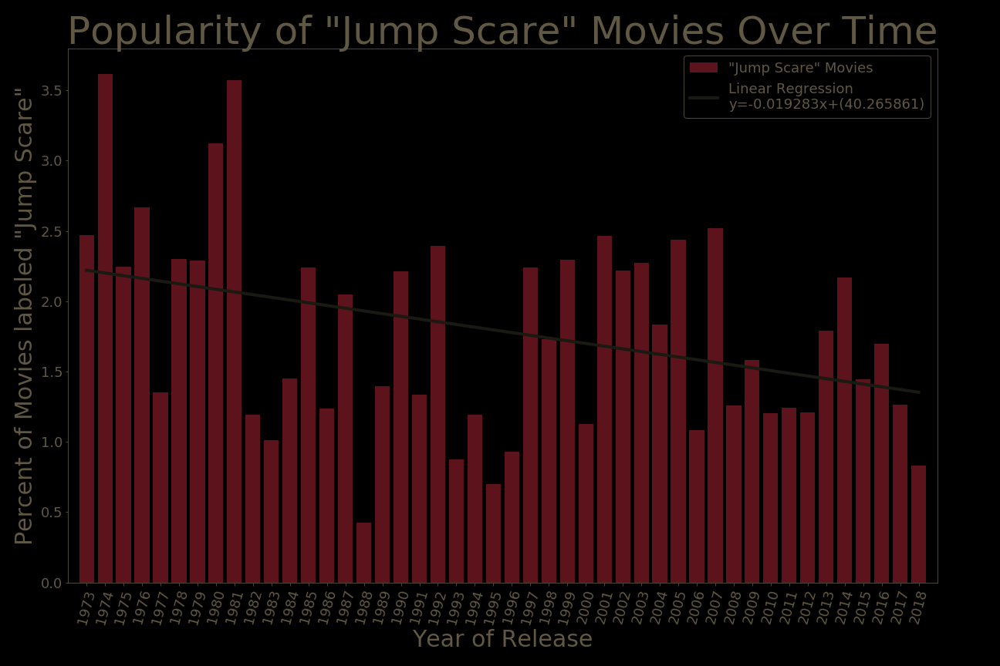

# Jump Scares in Horror, Thriller, and Sci-Fi Movies
# r/dataisbeautiful's DataViz Battle for October 2019

## Backgroud
For October 2019 Reddit's r/dataisbeautiful's DataViz Battle deals with Jump Scares in horror, thriller, and sci-fi movies. 

## Data Collection
This month it was a simple task to copy the dataset into a csv file. It's only 543 entries. Simple copy/paste. Nothing like [September 2019's](https://github.com/Agrattendick/DataVizCommentScoresSeptember2019) dataset.

## Data Analysis
There appear to be a few ways to view the data. Comparing the Jump Count and/or Jump Scare Rating to the IMDB rating, looking at Jump Count and/or Jump Scare Rating changes over the years, and possibly examining the Directors to see if any show up again and again. 

No numbers, but based off quick observations there appears to be a weak negative correlation between Imdb scores and Jump Count, Imdb and Jump Scare rating needs some more analysis but any connection appears unlikely. Jump Count and Jump Scare index does have a moderately strong positive correlation, but that's not surprising that both come from the same source.

Using the data to map the popularity of Jump Scare movies seems the best option. Looking at the percent of movies in a given year that Where's the Jump considers Jump Scare movies given all movies produced that year from The Numbers.

This worked well. While Jump Scare movies were never all that popular, over the past 45 years a smaller percent of an already small percent get made.

## Charting
Matplotlib and Jupyter Notebook were used for for graphing this bar chart. The base chart was fairly easy to produce. It's a simple bar chart with the x-axis showing the year and the y-axis showing perecnt of movies that were Jump Scare movies.  

The biggest decision was chosing the y-axis scale. Even at their peak, Jump Scare movies still make up less than 4% of all movies produced in a given year. Technically with the y-axis only labeled to 3.5% this implies the change in popularity decreased more than it did, but as movies are a multi-billion dollar industry, doing so in this case felt justified. (In 2018 worldwide movie ticket sales hit over 38 Billion Dollars. So even a small drop in popularity of Jump Scare movies could mean a loss of hundreds of millions of dollars.)  

This was also the first chart to radically change the color scheme. Simple changes to the plotted color were not new, but background changes, and label changes required some research. It was also the first exploration into color palettes, and what colors go well together.

## Links
[r/dataisbeautiful DataViz Battle for October 2019](https://www.reddit.com/r/dataisbeautiful/comments/dei68x/battle_dataviz_battle_for_the_month_of_october/)  
[Dataset of Jump Scare information](https://wheresthejump.com/full-movie-list/)  
[The Numbers](https://www.the-numbers.com/movies/#tab=year)